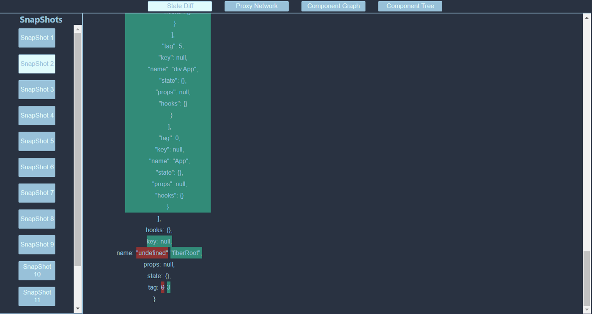
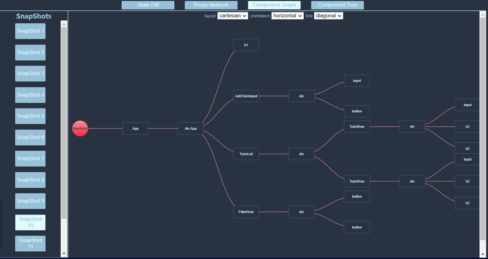

<a href="http://devaltio.io/">Click here to visit the deValtio website!</a>

<h2>deValtio, a Developer Tool for Valtio Applications</h2>
deValtio is a Google Chrome extension that serves as a visualization and debugging tool for <a href="https://github.com/pmndrs/valtio">Valtio, a proxy-based state management library</a> for <a href="https://reactjs.org/">React.js</a>.

<h2>How to Use deValtio</h2>

Go to the Google Chrome Store, search for deValtio and click "add to Chrome”. Open a project in your favorite IDE and start the project.
 

Once the project is up and running in the browser, open up the inspector and click on the deValtio tab. When state changes within your application, a message is sent to deValtio notifying the application of that change and a “snapshot” will be created of the react fiber tree reflecting the change. The developer is able to click on a snapshot to view the application's state at the time the snapshot was taken. The snapshot is sent across the application to the extension's 4 features: State Diff, Component Graph, Component Tree and Proxy Network.

<h2>Features</h2>
<h4>State Diff</h4>

As the state of the application changes, State Diff visualizes the difference in state from one snapshot to the next. When the React Fiber Tree changes, a message is emitted to deValtio. When this message is received, a new snapshot is created. Each snapshot is an image of the fiber tree at the moment the snapshot was taken. State Diff allows the developer to switch back and forth between snapshots and view the DOM/state at the time the snapshot was taken.

<h4>Component Graph</h4>

The Component Graph is a hierarchical representation of the React Fiber Tree. Each node in the tree represents a fiber tree node. When the mouse hovers over the node, the name, children, and state of the component are displayed in a tooltip. Component Graph is collapsible to allow the developer to focus only on the area of the tree they want to see.

<h4>Component Tree</h4>

Like the Component Graph, the Component Tree is also a visualization of the React Fiber Tree. The Component Tree is displayed as a collapsible, text-based nested object. Each object represents a fiber tree node and displays the name, children, tag, state and props of the fiber tree node.

<h2>Coming Soon</h4>
<h4>Time Travel</h4>
<h4>Proxy Network</h4>

<h2>Contributions Welcome</h2>
DeValtio is an open-source project and welcomes contributions. We encourage you to fork the repository, create a feature branch and submit a pull request. Also, please note our development tool is still in beta. If you find any issues, please report them in the issues tab or submit a pull request. We welcome all advice, improvements and fixes.

<h2>Core Team</h2>
<ul>
  <li>Sergey Zeygerman <a href="https://github.com/Sergey01/">Github</a> | <a href="https://www.linkedin.com/in/sergey-zeygerman/">Linkedin</a></li>
  <li>Cameron Walls <a href="https://github.com/cwalls45">Github</a> | <a href="https://www.linkedin.com/in/cameron-walls45/">Linkedin</a></li>
  <li>Tom Curtin <a href="https://github.com/3LD3ST">Github</a> | <a href="https://www.linkedin.com/in/tfcurtin/">Linkedin</a></li>
  <li>Damian Allert <a href="https://github.com/reddallert">Github</a> | <a href="https://www.linkedin.com/in/damian-allert-8494745/">Linkedin</a></li>
  <li>Gordon Hui <a href="https://github.com/maddogg612">Github</a> | <a href="https://www.linkedin.com/in/gordon-hui-78453935/">Linkedin</a></li>
 </ul>
