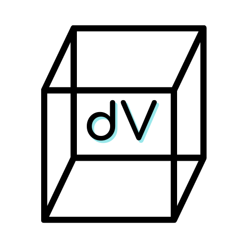

# deValtio

<h1>Developer Tool for Valtio applications</h1>

<h2>About</h2>
deValtio is a Google Chrome extension that serves as a visualization and debugging tool for the <a href="https://github.com/pmndrs/valtio">Valtio proxy state management library</a> for <a href="https://reactjs.org/">Reactjs</a>.

<h2>Getting Started/Installation</h2>

<h2>Features</h2>

<h2>Work in Progress</h2>

<h2>Contributing</h2>
DeValtio is an open-source project and welcomes contribution. Please fork the repository, create a feature branch and submit a pull request. 

<h2>Core Team</h2>
<ul>
  <li>Sergey <a href=#github>Github</a> | <a href=#linkedin>Linkedin</a></li>
  <li>Cameron Walls <a href=#github>Github</a> | <a href=#linkedin>Linkedin</a></li>
  <li>Tom Curtin <a href=#github>Github</a> | <a href=#linkedin>Linkedin</a></li>
  <li>Damian Allert <a href=#github>Github</a> | <a href=#linkedin>Linkedin</a></li>
  <li>Gordon Hui <a href=#github>Github</a> | <a href=#linkedin>Linkedin</a></li>
 </ul>
 
 <h2>License</h2>
